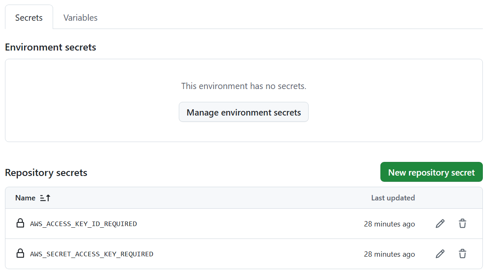
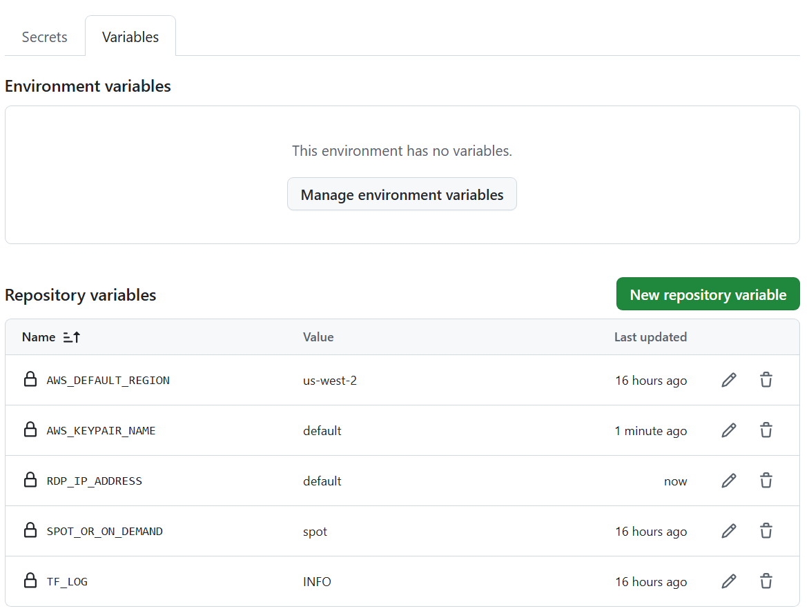

# EC2 Stable Diffusion

## Description
This repo uses GitHub Actions and Terraform to help you build a Windows EC2 instance (g4dn.xlarge by default) with Nvdia T4 GPU (16GB) quickly and easily. Currently it installs Stable Diffusion, but it could be used for ML applications or even for cloud gaming. It automatically creates its own Terraform backend so you don't have to worry about that. By default it creates a spot instance for cost efficiency (can be changed to on_demand in GitHub variables).

Use this repo to build the instance using the "terraform-apply" GitHub Action (instructions below), then simply install what you need and shut down when not using it. This way you don't have to re-install everything you want each time you use it. Then, when you are finished with it, run the "terraform-destroy" action, which will remove all resources as well as the Terraform backend.

All that's needed from you is an AWS Access Key and Secret, which can be entered using GitHub Actions secrets (again, instructions below).


## Instructions for Use
- Fork a copy of this repo for yourself.
- Navigate to the "Actions" tab in your forked repo and enable them.
- If you don't have one already, create the IAM user for Terraform and grant it the appropriate permissions (see security note below). Then, create an access key for this user. This will give you your Github Actions Secrets, which are this "ACCESS_KEY_ID_REQUIRED" and "SECRET_ACCESS_KEY_REQUIRED."
- Once you have these secrets, insert them into your forked GitHub repo under Settings (top menu) --> Secrets and Variables (left nav) --> Actions (left nav dropdown) --> Secrets (tab in body). See example screenshot .
- Create the Github Actions Variables as seen in this . (They are in the original repo but are only visible to collaborators, so you have to re-create them yourself.) If you want to customize any variables with the "default" setting, feel free to do so. See note below for more specifics on variables.
- Navigate to Actions (top menu) --> terraform-apply (left nav) --> Run workflow (dropdown at top right) and select "Run workflow" from the dropdown.
- If you have entered your key/secret and variables correctly, the instance will start building in your AWS account. WARNING: You WILL incur charges for this instance and any associated resources!
- Once it has finished building, log in using the keypair for the instance. Using the AWS Console, right click on the instance and select "Connect." If you have entered the name of your own keypair (recommended) in the GitHub Actions Variables section, the instance will use that keypair. Otherwise there will be a new keypair created for it (see security note below). Use that keypair to log in to the EC2 instance.
- Once you have logged in, double-click the Stable Diffusion batch shortcut to finish installing python, git and Stable Diffusion. It may require that you "babysit" the window a while to be sure everything finishes. When it's done, the default web browser will start with Stable Diffusion via the Automatic1111 interface.
- You may now download any SD models and operate it as usual. If not using the instance for SD, simply install your software on it and then shut the instance down when not in use to minimize charges (may incur some minimal charges for EBS storage when the instance is shut down).

Note: There are other GitHub Actions Variables which can be entered in order to specify your own keypair (recommended) and specify the AWS Region (among other things). Experiment with these to see what gives best results. Also, if for some reason there is an incomplete  GitHub Action (i.e., terraform-apply doesn't finish) you may have to manually delete a) the S3 bucket used for the backend and b) the associated DynamoDB table. Then, just re-run as normal.

Variables Note: Here are a couple of examples of customized variables. They must be present here. AWS_KEYPAIR_NAME and RDP_IP_ADDRESS must either contain the text "default" or they need very specific values from you. Please be precise about entering them.
```
RDP_IP_ADDRESS      default     [Your IP address to open security group for RDP]
AWS_KEYPAIR_NAME    default    [Use your own AWS keypair (recommended)]
AWS_DEFAULT_REGION  us-west-2       [Enter the AWS region you'd like to use]
SPOT_OR_ON_DEMAND   spot            [Enter "spot" or "on_demand" ("spot" recommended for cost efficiency)]
TF_LOG              info            [keep this one the same unless you want something specific (advanced)]
```

Security Note: Ideally your IAM user for terraform should have only the minimal permissions attached to it. You can use the IAM Access Analyzer to help with this. Also, be aware that if you use the default keypair generated by this repo, the S3 bucket with the Terraform backend should be treated as a secret, as it also contains a copy of the associated private key.

TODO: generate and create all IAM permissions from within Terraform.
